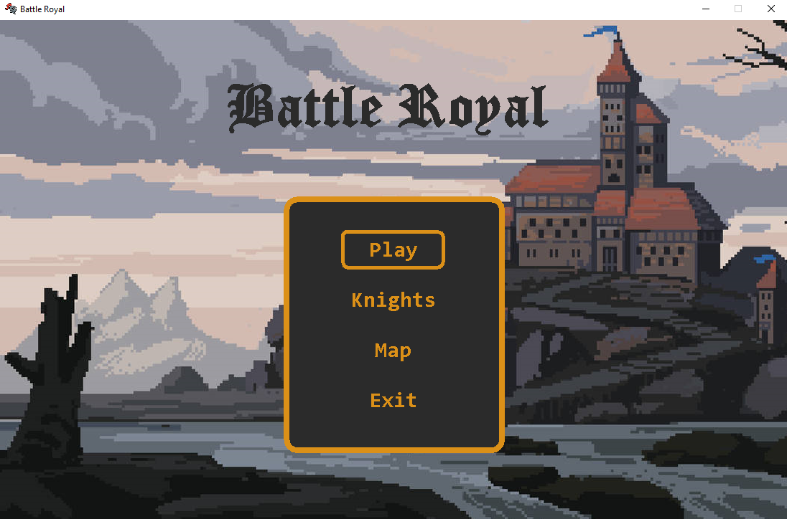
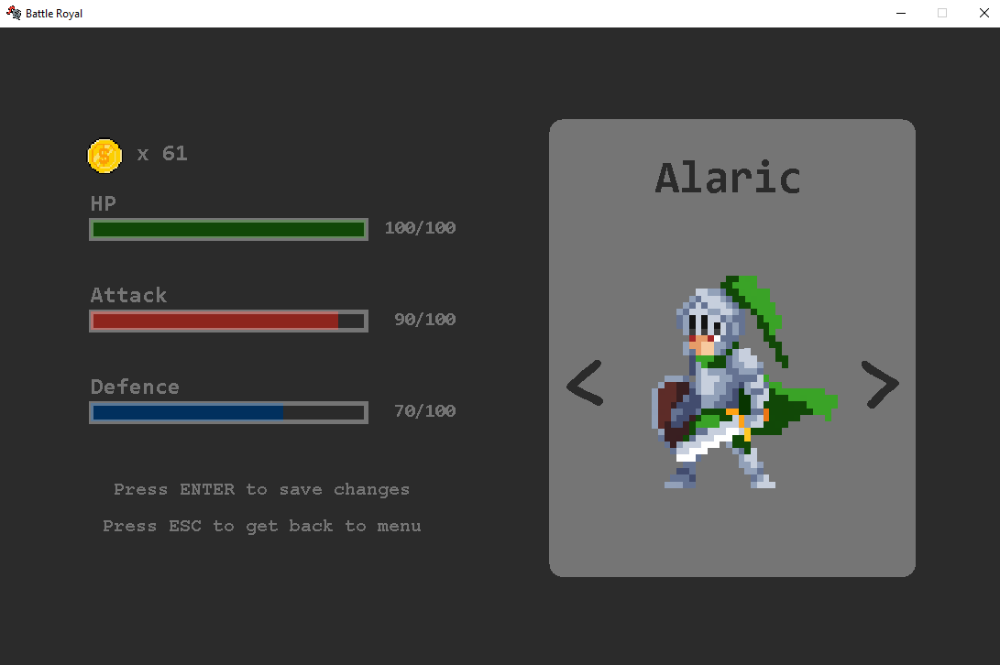
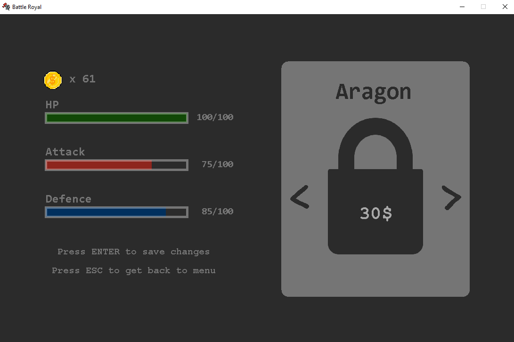

# 🗡️ Action RPG Game (Java)

## 📖 Popis projektu
Tento projekt je akčná RPG hra vytvorená v jazyku **Java**, v ktorej si hráč vyberá jedného zo zakúpených rytierov a postupne prechádza jednotlivé levely. Cieľom hry je poraziť všetkých nepriateľov v časovom limite a strategicky využívať schopnosti vybraného rytiera.

---

## 🎮 Herný princíp
Hráč si môže vybrať **jedného z 3 rytierov**, pričom každý má rozdielne:
- životy (**HP**)
- útok (**Attack**)
- obranu (**Defence**)

Cena rytiera závisí od jeho vlastností.  
Herné peniaze hráč získava počas hry a používa ich na nákup rytierov a máp.

Hra obsahuje **4 levely**, v každom z nich sa nachádza nepriateľ.  
Nepriateľ útočí späť, takže hráč musí využívať obranu a útok strategicky.

⏱️ **Časový limit hry je 5 minút.**

---

## 🏆 Výhra a prehra
- **Výhra** – hráč porazí všetkých nepriateľov do 5 minút
- **Prehra** – hráčovi klesne HP na 0 alebo prekročí časový limit

---

## 🧭 Menu hry
Po spustení hry sa zobrazí hlavné menu.  
Pohyb v menu je možný pomocou šípok **hore / dole**, výber sa potvrdzuje klávesom **ENTER**.
 

### Možnosti menu

#### 1️⃣ Play
- Spustí samotnú hru
- **Ovládanie:**
  - pohyb – šípky
  - obrana – šípka dole
  - útok – klávesy **A, S, D**
  - **ESC** – zobrazí dialógové okno (pokračovať / návrat do menu)

  
  

#### 2️⃣ Knights
- Výber rytiera
- Pohyb medzi rytiermi – šípky **vľavo / vpravo**
- Ak je rytier uzamknutý, zobrazí sa cena
- **ENTER** – kúpa alebo výber rytiera
- **ESC** – návrat do menu

  
  

#### 3️⃣ Maps
- Výber mapy
- Pohyb medzi mapami – šípky **vľavo / vpravo**
- Niektoré mapy je potrebné zakúpiť
- **ENTER** – kúpa alebo výber mapy
- **ESC** – návrat do menu

  
#### 4️⃣ Exit
- Ukončenie hry a zatvorenie aplikácie
